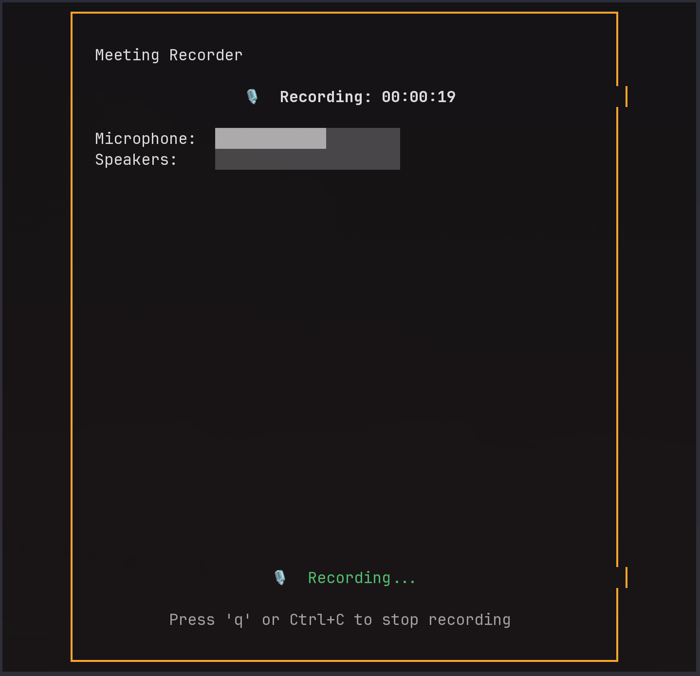

# Meeting Recorder

A lightweight, one-click meeting recorder for Linux that captures microphone and speaker audio, transcribes in real-time using Whisper, summarizes with a local LLM, and exports to your Obsidian vault.

## Features

- **One-command operation** - Launch with `./meeting-recorder`
- **Live TUI monitoring** - Real-time recording timer and audio level indicators
- **Mixed audio capture** - Records both microphone and speaker output
- **Real-time transcription** - Uses faster-whisper for accurate speech-to-text
- **AI-powered summarization** - Generates structured summaries with local LLM (Ollama)
- **Obsidian integration** - Automatically saves transcripts and summaries to your vault
- **Graceful shutdown** - Press 'q' or Ctrl+C to stop and process

## Screenshot



## Requirements

### System
- **OS**: Linux with PipeWire audio server
- **Python**: 3.10 or higher
- **Ollama**: Local LLM server (for summarization)

### System Packages
```bash
# Arch Linux
sudo pacman -S python pipewire ffmpeg

# Ubuntu/Debian
sudo apt install python3 python3-pip pipewire ffmpeg
```

### Ollama Setup
Install Ollama and pull a model:
```bash
# Install Ollama (see https://ollama.ai)
curl -fsSL https://ollama.ai/install.sh | sh

# Pull a model (choose one)
ollama pull llama3.2:3b    # Faster, smaller
ollama pull llama3.1:8b    # Better quality

# Start Ollama service
ollama serve
```

## Installation

1. **Clone the repository**
   ```bash
   git clone <repository-url>
   cd Meeting-Notes
   ```

2. **Create virtual environment**
   ```bash
   python3 -m venv venv
   source venv/bin/activate
   ```

3. **Install Python dependencies**
   ```bash
   pip install -r requirements.txt
   ```

4. **Make the launcher executable**
   ```bash
   chmod +x meeting-recorder
   ```

5. **Configure output path**
   Edit `config.yaml` and set your Obsidian vault path:
   ```yaml
   output_dir:
     base_path: "/path/to/your/ObsidianVault"
     meetings_subdir: "meetings"
   ```

## Configuration

Edit `config.yaml` to customize settings:

```yaml
# Output directory settings
output_dir:
  base_path: "/home/user/Documents/Obsidian Vault"
  meetings_subdir: "meetings"

# Audio settings
audio:
  sample_rate: 16000
  format: s16le
  channels: 1

# Transcription settings
whisper:
  model: base  # Options: tiny, base, small, medium, large
  device: cpu  # Options: cpu, cuda, auto
  language: en

# Summarization settings
summarization:
  ollama_endpoint: "http://localhost:11434"
  model: "llama3.2:3b"

# Output settings
output:
  keep_audio: true
  timestamp_format: "%Y-%m-%d_%H-%M-%S"
```

## Usage

### Basic Usage

1. **Start recording**
   ```bash
   ./meeting-recorder
   ```

2. **Monitor the TUI**
   - Watch the recording timer
   - Verify audio levels are responding (mic and speakers)
   - Confirm capture is working

3. **Stop recording**
   - Press `q` or `Ctrl+C`
   - Wait for processing (transcription + summarization)
   - Files will be saved to your Obsidian vault

### Output Files

The tool creates files in your configured Obsidian directory:

```
~/ObsidianVault/meetings/
├── recording_2025-10-03_14-30-00.wav
├── transcript_2025-10-03_14-30-00.txt
└── summary_2025-10-03_14-30-00.md
```

### Summary Format

Summaries are structured with the following sections:
- **Summary**: Brief overview of the meeting
- **Key Points**: Main discussion topics
- **Decisions**: Decisions made during the meeting
- **Action Items**: Tasks and responsibilities
- **Questions**: Open questions or unresolved topics

## How It Works

1. **Audio Capture**: Uses PipeWire to create a null sink that mixes microphone and speaker audio
2. **Live Monitoring**: TUI displays real-time audio levels and recording duration
3. **Transcription**: Streams audio to faster-whisper for real-time speech-to-text
4. **Summarization**: Sends transcript to local Ollama LLM for structured summary generation
5. **Export**: Saves all files (audio, transcript, summary) to your Obsidian vault

## Troubleshooting

### No audio levels showing
- Verify PipeWire is running: `systemctl --user status pipewire`
- Check audio devices: `pactl list sources`

### Transcription not working
- Ensure faster-whisper model is downloaded (happens automatically on first run)
- Check disk space for model storage (~1-5GB depending on model size)

### Summarization fails
- Verify Ollama is running: `curl http://localhost:11434/api/tags`
- Check that model is pulled: `ollama list`
- Ensure model name in config.yaml matches pulled model

### Files not appearing in Obsidian
- Verify the `base_path` in `config.yaml` is correct
- Check that the directory exists and is writable
- Look for files in the `recordings/` subdirectory

## Performance Notes

- **Whisper model selection**:
  - `tiny`: Fastest, lowest accuracy
  - `base`: Good balance (recommended for CPU)
  - `small`: Better accuracy, slower
  - `medium`: High accuracy, requires more resources
  - `large`: Best accuracy, GPU recommended

- **Processing time**: Expect 1-2x real-time (30min meeting = 30-60min processing)
- **Resource usage**: Transcription is CPU/GPU intensive, summarization is moderate

## Development

See `PLAN.md` for the complete implementation plan and architecture details.

## License

MIT License - see LICENSE file for details
